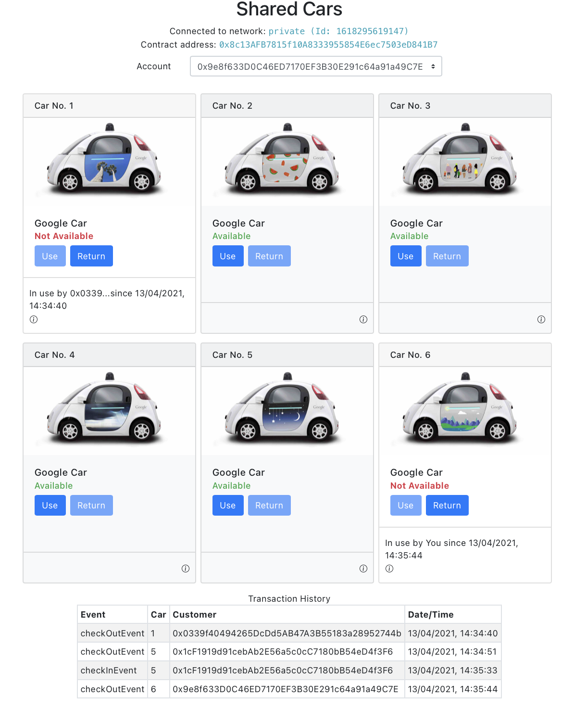

# A PoC of shared vechicle using Non-fungible token (NFT)
A shared vechicle, and more specifically its right-to-use, is modelled using a [RC721](https://docs.openzeppelin.com/contracts/3.x/erc721) token.  The two key end user operations `check-out` (renting a vechicle) and `check-in` (returning a vechicle) are modeled as Ethereum transactions in the [Solidity contact](contacts/SharedEv.sol).

## Running the app
The app and a personal Ethereum blockchain have been [dockerized](docker-compose.yml).

1. To start the app and [`ganache-cli`](https://github.com/trufflesuite/ganache-cli)
```
docker-compose up
```
2. Open `localhost:3000` in your web browser to run the app

## Screenshoot


